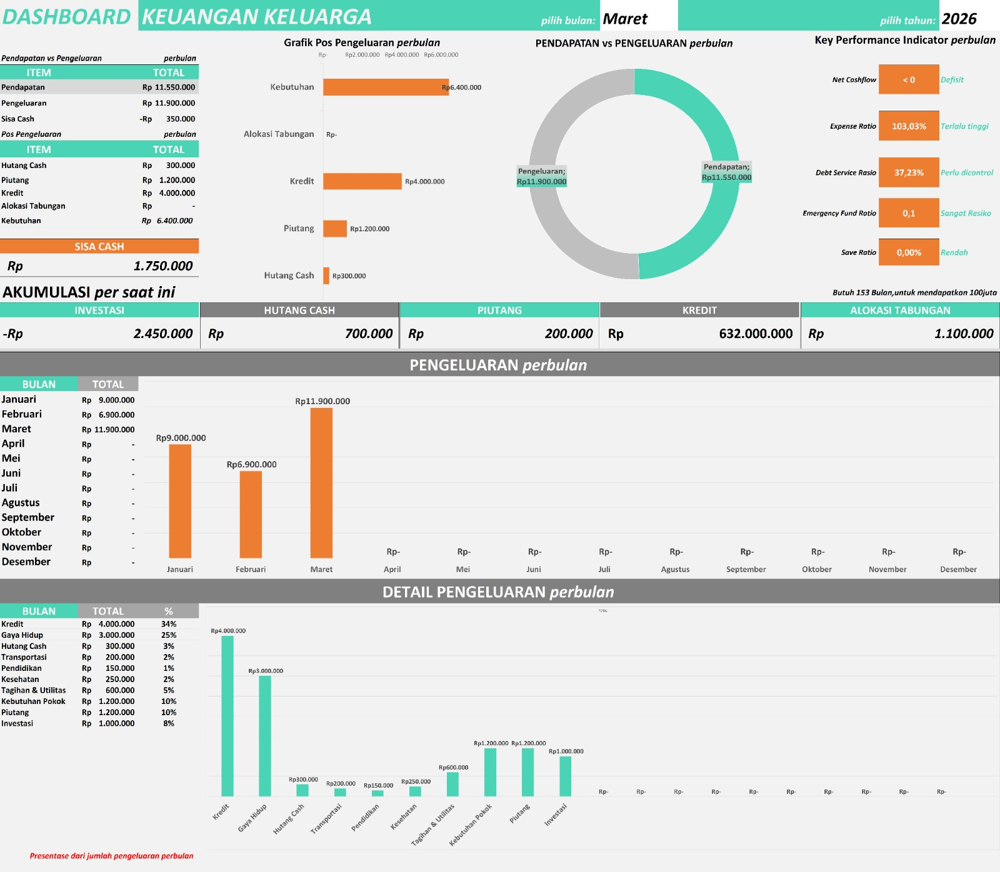
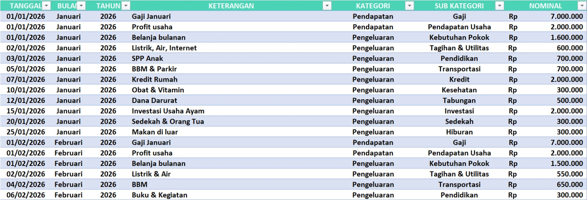
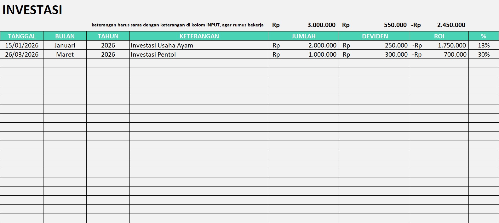
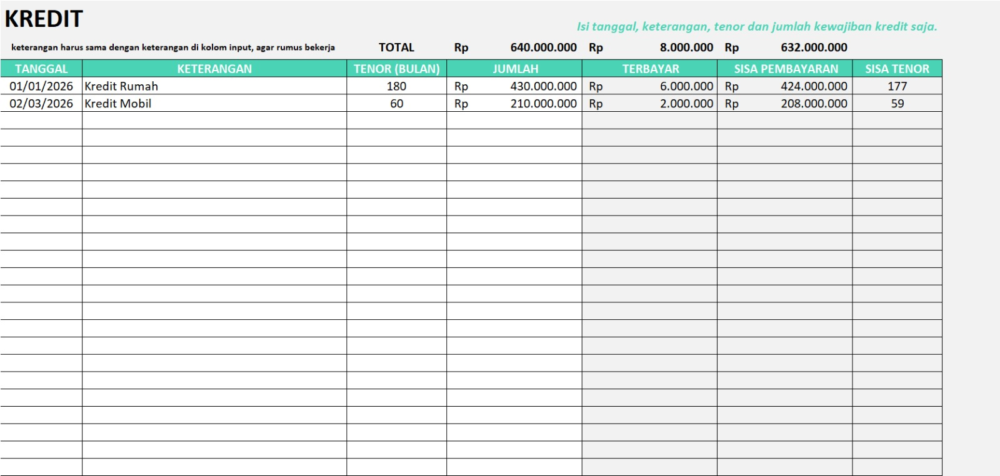

# Template dan Dashboard Keuangan Keluarga

Sistem sederhana berbasis Excel untuk mencatat, memonitor, dan mengelola keuangan keluarga secara terstruktur.

---

## Tampilan Sistem

---

## Struktur Sistem

Sistem ini terdiri dari 5 modul utama:

---

## 1. INPUT TRANSAKSI

Modul utama untuk mencatat semua aktivitas keuangan.

### Tampilan Input

### Sheet: input
Kolom:
- Tanggal
- Jenis (Masuk / Keluar)
- Kategori
- Nominal
- Keterangan

👉 Semua data keuangan dimulai dari sini

---

## 2. DASHBOARD

Modul untuk melihat ringkasan keuangan secara otomatis.

### Tampilan Dashboard

### Fitur:
- Total pemasukan
- Total pengeluaran
- Sisa saldo
- Grafik transaksi bulanan
- Analisis pengeluaran terbesar

👉 Semua data diambil dari file input

---

## 3. ALOKASI TABUNGAN 

Modul untuk membagi pendapatan secara otomatis.

### 🖼️ Tampilan Alokasi Tabungan

### Komponen:
- Persentase tabungan
- Dana darurat
- Kebutuhan harian
- Alokasi wajib lainnya

### Output:
- Nominal masing-masing pos keuangan

---

## 4. INVESTASI 

Modul untuk mengelola dan memonitor aset investasi.

### Tampilan Investasi

### Sheet: investasi
- Jenis investasi
- Modal awal
- Nilai sekarang
- Keuntungan / kerugian
- Persentase return

👉 Digunakan untuk tracking pertumbuhan aset

---

## 5. MONITORING KREDIT 

Modul untuk mengontrol semua pinjaman dan cicilan.

### Tampilan Kredit

### Sheet: kredit
- Nama pinjaman
- Total hutang
- Cicilan bulanan
- Tenor
- Sisa hutang

👉 Untuk memastikan semua utang terkontrol
